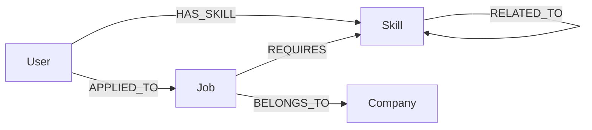

# Wexa AI – Job & Skill Recommendation

A take-home assignment application that recommends jobs based on a user’s skills using a **CognoDB** graph database (Neo4j-compatible Bolt protocol).

For install and run steps, see **[docs/SETUP.md](docs/SETUP.md)**.  
For a deeper technical write-up of the backend design, see **[spec.md](spec.md)**.

---

## 1. Project Overview

This app helps a hiring / career platform answer:

> “Given what this person knows, which jobs fit — and which company owns them?”

**Main user flow**

1. Open the React dashboard.
2. Select a user from the dropdown.
3. View that user’s profile (name, email) and skills.
4. Browse **recommended jobs** produced by a multi-hop graph traversal (`User → Skill ← Job`).
5. Click a job card to load **job details** (company, industry, location, experience, required skills) and **related skills** from the graph.

The frontend talks to an Express API. The API runs parameterized Cypher through the official Neo4j JavaScript driver against CognoDB.

---

## 2. Why a Graph Database?

Job–skill recommendation is a **relationship** problem, not just a table lookup.

The natural domain path is:

```text
User → Skill → Job → Company
```

In this project that maps to:

```text
(User)-[:HAS_SKILL]->(Skill)<-[:REQUIRES]-(Job)-[:BELONGS_TO]->(Company)
```

**Why CognoDB / a graph fits better than a typical relational design here**

| Concern | Relational approach | Graph approach (this app) |
|--------|----------------------|---------------------------|
| “Jobs matching my skills” | Several join tables (`user_skills`, `job_skills`, …) and multi-table joins | One Cypher path pattern |
| Multi-hop recommendations | Often recursive CTEs or app-side stitching | Native multi-hop `MATCH` |
| Related skills | Extra join table + more joins | `Skill-[:RELATED_TO]->Skill` in the same traversal |
| Explainability | Harder to keep “why this job” with the result | Return matching skills / related skills on the same path |

**Multi-hop recommendations are natural in a graph** because the query expresses the business question as a path: start at a user, walk to skills, then to jobs that require those skills (and optionally to the company and related skills). That is exactly what `/api/users/:userId/recommendations` does.

---

## 3. Technology Stack

### Frontend
- React
- Vite
- JavaScript
- Tailwind CSS
- Fetch API

### Backend
- Node.js
- Express.js
- dotenv
- CORS
- nodemon (development)

### Data / graph
- CognoDB (Bolt-compatible graph database)
- Official `neo4j-driver` (JavaScript)
- Cypher query language

---

## 4. Architecture

```text
React Frontend
      ↓
Express Backend
      ↓
Neo4j JavaScript Driver
      ↓
CognoDB
      ↓
Graph Data
```

**Layering in code**

- **UI** (`frontend/`) — dashboard, profile, recommendations, job details
- **HTTP API** (`backend/src/routes/`) — thin Express handlers
- **Query layer** (`backend/src/queries/jobQueries.js`) — parameterized Cypher only
- **Driver** (`backend/src/db/neo4j.js`) — reusable CognoDB connection
- **Seed** (`backend/src/seed.js`) — idempotent `MERGE` sample graph

---

## 5. Graph Data Model

### Nodes

| Label | Properties | Description |
|-------|------------|-------------|
| **User** | `id`, `name`, `email` | Candidate |
| **Skill** | `id`, `name`, `category` | Competency |
| **Job** | `id`, `title`, `location`, `experience` | Open role |
| **Company** | `id`, `name`, `industry` | Employer |

### Relationships

| Relationship | Pattern | Meaning |
|--------------|---------|---------|
| **HAS_SKILL** | `(User)-[:HAS_SKILL]->(Skill)` | User has a skill |
| **APPLIED_TO** | `(User)-[:APPLIED_TO]->(Job)` | User applied to a job |
| **REQUIRES** | `(Job)-[:REQUIRES]->(Skill)` | Job requires a skill |
| **BELONGS_TO** | `(Job)-[:BELONGS_TO]->(Company)` | Job belongs to a company |
| **RELATED_TO** | `(Skill)-[:RELATED_TO]->(Skill)` | Skills are related |

### Mermaid diagram



Seeded sample size: **5 Users**, **10 Skills**, **6 Jobs**, **4 Companies** (via `npm run seed` in `backend/`).

---

## 6. Main Cypher Queries

Implemented in `backend/src/queries/jobQueries.js` (routes never embed Cypher).

### `getAllUsers`
- **Purpose:** List all users  
- **Traversal:** `MATCH (u:User)`  
- **Parameters:** none  
- **Useful for:** Populating the frontend user selector  

### `getAllSkills`
- **Purpose:** List all skills  
- **Traversal:** `MATCH (s:Skill)`  
- **Parameters:** none  
- **Useful for:** Skill catalog endpoint  

### `getAllJobsWithCompanies`
- **Purpose:** List jobs with their companies  
- **Traversal:** `(Job)-[:BELONGS_TO]->(Company)`  
- **Parameters:** none  
- **Useful for:** Job board listing  

### `getSkillsForUser($userId)`
- **Purpose:** Skills for one user  
- **Traversal:** `(User)-[:HAS_SKILL]->(Skill)`  
- **Parameters:** `userId`  
- **Useful for:** User profile section  

### `getJobById($jobId)`
- **Purpose:** Job detail + company + required skills  
- **Traversal:** `(Job)-[:BELONGS_TO]->(Company)`, optional `(Job)-[:REQUIRES]->(Skill)`  
- **Parameters:** `jobId`  
- **Useful for:** Job details panel  

### Multi-hop: `getJobsMatchingUserSkills($userId)` *(assignment core pattern)*
- **Purpose:** Find jobs that share skills with the user  
- **Traversal (2+ hops):**

```text
(User)-[:HAS_SKILL]->(Skill)<-[:REQUIRES]-(Job)
```

- **Parameters:** `userId`  
- **Useful for:** Pure skill–job matching with `matchingSkills` and `matchCount`  

### Recommendation query: `getRecommendedJobsForUser($userId)` *(used by the API)*
- **Purpose:** Recommend jobs and explain them in one traversal  
- **Traversal:**

```text
(User)-[:HAS_SKILL]->(Skill)<-[:REQUIRES]-(Job)-[:BELONGS_TO]->(Company)
OPTIONAL (Skill)-[:RELATED_TO]->(related Skill)
```

- **Parameters:** `userId`  
- **Useful for:** Frontend recommendations — returns company, matching skills, related skills, and `matchCount`  

### Supporting traversals
- **`getRelatedSkills($skillId)`** — `Skill-[:RELATED_TO]->Skill`  
- **`getUserSkillJobCompanyGraph($userId)`** — `User → Skill → Job → Company` path rows for explainability  

All of the above use **parameterized** Cypher (`$userId`, `$jobId`, etc.).

---

## 7. API Overview

Base URL (local): `http://localhost:3000/api`

| Method | Endpoint | Purpose |
|--------|----------|---------|
| `GET` | `/health` | Backend liveness |
| `GET` | `/health/db` | CognoDB connectivity check |
| `GET` | `/users` | List all users |
| `GET` | `/skills` | List all skills |
| `GET` | `/jobs` | List jobs with companies |
| `GET` | `/users/:userId/skills` | Skills for a user |
| `GET` | `/users/:userId/recommendations` | Graph-based job recommendations |
| `GET` | `/jobs/:jobId` | Job details, company, required skills |

No authentication is implemented (by design for this assignment stage).

---

## 8. Screenshots

Add screenshots here after capture:

### Dashboard / user selector


### User profile and skills


### Recommended jobs


### Job details and related skills


> Place image files under `docs/screenshots/` (create the folder when you add images).

---

## 9. Project Structure

```text
wexa-cognodb-graph-app/
├── README.md                 # This document
├── spec.md                   # Detailed technical specification
├── docs/
│   └── SETUP.md              # Install & run guide
├── backend/
│   ├── .env.example          # Backend env placeholders (no secrets)
│   ├── package.json          # Backend scripts/dependencies
│   └── src/
│       ├── server.js         # Express entry, health, route mounting
│       ├── seed.js           # MERGE-based sample graph seed
│       ├── db/neo4j.js       # CognoDB driver connection
│       ├── queries/jobQueries.js  # Parameterized Cypher functions
│       ├── routes/           # users, skills, jobs HTTP routes
│       └── utils/errors.js   # Shared API / 503 handling
└── frontend/
    ├── .env.example          # Frontend API base URL placeholder
    ├── package.json          # Frontend scripts/dependencies
    └── src/
        ├── App.jsx
        ├── main.jsx
        ├── pages/Dashboard.jsx
        ├── components/       # UI building blocks
        └── services/api.js   # Fetch wrappers for backend APIs
```

There is also an empty top-level `database/` folder from initial scaffolding; graph seed/logic lives in `backend/src/seed.js`, not in that folder.

---

## 10. Security

| Practice | How this project applies it |
|----------|-----------------------------|
| **Environment variables** | CognoDB URI/username/password and API URL come from env files |
| **`.env`** | Local only; holds real values on your machine |
| **`.gitignore`** | Backend and frontend ignore `.env` (and `node_modules/`) |
| **`.env.example`** | Safe placeholders only — safe to commit |
| **Parameterized Cypher** | User/job IDs passed as query parameters, never concatenated into Cypher strings |
| **No credentials in Git** | Do not commit passwords, tokens, or live Bolt credentials |

This README intentionally contains **no real secrets**.

---

## Quick start

Full instructions: **[docs/SETUP.md](docs/SETUP.md)**

```bash
# Backend
cd backend
npm install
# create .env from .env.example, then:
npm run seed
npm start

# Frontend (new terminal)
cd frontend
npm install
# create .env from .env.example, then:
npm run dev
```

- Backend: `http://localhost:3000`  
- Frontend: `http://localhost:5173`
