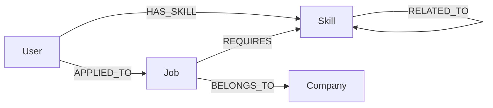

# Wexa Cognodb Graph App — Technical Specification

## 1. Project Overview

| Item                             | Detail                                                                                                                                                                                                  |
| -------------------------------- | ------------------------------------------------------------------------------------------------------------------------------------------------------------------------------------------------------- |
| **Project name**                 | `wexa-cognodb-graph-app`                                                                                                                                                                                |
| **Purpose**                      | A Job & Skill Recommendation backend that stores people, skills, jobs, and companies as a connected graph and recommends jobs by traversing those relationships.                                        |
| **Wexa AI assignment objective** | Build a CognoDB (Neo4j-compatible) graph application that demonstrates multi-hop Cypher traversals for skill-based job recommendations, with a clean Express API layer on top of parameterized queries. |

**Current status:** Backend foundation, CognoDB connection, graph seed data, Cypher query layer, and REST APIs are implemented. Frontend is not started yet.

---

## 2. Technology Stack

| Technology        | Role in this project                                                 |
| ----------------- | -------------------------------------------------------------------- |
| **Node.js**       | Runtime for the backend                                              |
| **Express.js**    | HTTP API server and routing                                          |
| **CognoDB**       | Managed graph database (Bolt-compatible with Neo4j protocol)         |
| **neo4j-driver**  | Official Neo4j JavaScript driver used to talk to CognoDB over Bolt   |
| **Cypher**        | Query language for graph reads/writes                                |
| **dotenv**        | Loads configuration from `.env` without hardcoding secrets           |
| **CORS**          | Allows cross-origin requests (needed when a frontend is added later) |
| **nodemon** (dev) | Auto-restarts the server during local development                    |

---

## 3. Current Project Structure

```text
wexa-cognodb-graph-app/
├── README.md
├── spec.md                 # This technical specification
├── frontend/               # Placeholder only (not implemented)
├── database/               # Placeholder only (not implemented)
└── backend/
    ├── .env                # Local secrets (gitignored)
    ├── .env.example        # Safe placeholders for required env vars
    ├── .gitignore          # Ignores node_modules/ and .env
    ├── package.json        # Dependencies and npm scripts
    ├── package-lock.json
    └── src/
        ├── server.js       # Express app entry: middleware, health, routes, startup/shutdown
        ├── seed.js         # MERGE-based graph seed script
        ├── db/
        │   └── neo4j.js    # Reusable Neo4j/CognoDB driver, verify, close
        ├── queries/
        │   └── jobQueries.js  # All parameterized Cypher query functions
        ├── routes/
        │   ├── users.js    # /api/users* endpoints
        │   ├── skills.js   # /api/skills endpoint
        │   └── jobs.js     # /api/jobs* endpoints
        └── utils/
            └── errors.js   # Shared API/DB error handling helpers
```

### File purposes (backend)

| File                        | Purpose                                                                               |
| --------------------------- | ------------------------------------------------------------------------------------- |
| `src/server.js`             | Boots Express, mounts routers, verifies CognoDB on startup, closes the driver on exit |
| `src/db/neo4j.js`           | Creates the driver from env vars; exports `verifyConnection` and `closeDriver`        |
| `src/seed.js`               | Inserts realistic Users, Skills, Jobs, Companies and relationships with `MERGE`       |
| `src/queries/jobQueries.js` | Isolates Cypher from HTTP routes; exports query functions                             |
| `src/routes/*.js`           | Thin Express handlers: validate params, call queries, return JSON                     |
| `src/utils/errors.js`       | Maps connection failures to HTTP 503 and other failures to 500                        |
| `.env.example`              | Documents required env keys without real credentials                                  |
| `.gitignore`                | Prevents committing `node_modules/` and `.env`                                        |

---

## 4. CognoDB Configuration

### How the app connects

1. `dotenv` loads environment variables when the process starts (`server.js` / `seed.js`).
2. `src/db/neo4j.js` reads `COGNODB_URI`, `COGNODB_USERNAME`, and `COGNODB_PASSWORD`.
3. It creates a driver with `neo4j.driver(uri, neo4j.auth.basic(username, password))`.
4. On server start, `verifyConnection()` runs `RETURN 1 AS result`.
5. If verification fails, the process exits and the API does not start.
6. On `SIGINT` / `SIGTERM`, the driver is closed gracefully.

### Environment variables

| Variable           | Purpose                                                    |
| ------------------ | ---------------------------------------------------------- |
| `PORT`             | HTTP port (defaults to `3000` if unset)                    |
| `COGNODB_URI`      | Bolt URI for CognoDB (e.g. `bolt://...` or `bolt+s://...`) |
| `COGNODB_USERNAME` | Database username                                          |
| `COGNODB_PASSWORD` | Database password                                          |

Copy `.env.example` to `.env` and fill in real values locally. **Never commit real credentials.** This document intentionally does not include any secrets.

---

## 5. Graph Data Model

### Nodes

| Label       | Properties                              | Meaning                           |
| ----------- | --------------------------------------- | --------------------------------- |
| **User**    | `id`, `name`, `email`                   | Candidate / applicant             |
| **Skill**   | `id`, `name`, `category`                | Competency (e.g. JavaScript, AWS) |
| **Job**     | `id`, `title`, `location`, `experience` | Open role                         |
| **Company** | `id`, `name`, `industry`                | Employer posting the job          |

### Relationships

| Relationship   | Direction                        | Meaning                            |
| -------------- | -------------------------------- | ---------------------------------- |
| **HAS_SKILL**  | `(User)-[:HAS_SKILL]->(Skill)`   | User possesses a skill             |
| **APPLIED_TO** | `(User)-[:APPLIED_TO]->(Job)`    | User applied to a job              |
| **REQUIRES**   | `(Job)-[:REQUIRES]->(Skill)`     | Job needs a skill                  |
| **BELONGS_TO** | `(Job)-[:BELONGS_TO]->(Company)` | Job is posted by a company         |
| **RELATED_TO** | `(Skill)-[:RELATED_TO]->(Skill)` | Skills that are related / adjacent |

---

## 6. Graph Model Diagram



Conceptual recommendation path (multi-hop):

```text
(User)-[:HAS_SKILL]->(Skill)<-[:REQUIRES]-(Job)-[:BELONGS_TO]->(Company)
                     |
                     +-[:RELATED_TO]->(Skill)
```

---

## 7. Seed Data

Implemented in `backend/src/seed.js` and run via `npm run seed`.

### Counts

| Entity    | Count |
| --------- | ----: |
| Users     |     5 |
| Skills    |    10 |
| Jobs      |     6 |
| Companies |     4 |

### Relationships created

- Skill ↔ Skill via `RELATED_TO` (adjacent technologies)
- User → Skill via `HAS_SKILL`
- User → Job via `APPLIED_TO`
- Job → Skill via `REQUIRES`
- Job → Company via `BELONGS_TO`

Seed data is intentionally realistic for a tech hiring domain (e.g. Full Stack Engineer at NovaSoft Labs requiring JavaScript/React/Node.js).

### Why `MERGE` is used

`MERGE` creates a node/relationship if it does not exist, otherwise matches the existing one. That makes the seed script **idempotent**: running it multiple times updates properties as needed and does **not** create duplicate Users/Skills/Jobs/Companies or duplicate relationship edges keyed the same way.

All seed Cypher uses **parameters** (`$users`, `$skills`, etc.), never string-concatenated input.

---

## 8. Cypher Queries

All query functions live in `backend/src/queries/jobQueries.js`. Routes never embed Cypher.

| Function                              | Parameters | What it does                                                                | Why it is useful                                        |
| ------------------------------------- | ---------- | --------------------------------------------------------------------------- | ------------------------------------------------------- |
| `getAllUsers()`                       | none       | Returns all users (`id`, `name`, `email`)                                   | List candidates for UI / selection                      |
| `getUserById(userId)`                 | `$userId`  | Returns one user or `null`                                                  | Existence checks before user-scoped APIs                |
| `getAllSkills()`                      | none       | Returns all skills                                                          | Skill catalog                                           |
| `getAllJobsWithCompanies()`           | none       | Jobs joined to their company via `BELONGS_TO`                               | Job board listing                                       |
| `getJobById(jobId)`                   | `$jobId`   | Job + company + required skills                                             | Job detail page                                         |
| `getSkillsForUser(userId)`            | `$userId`  | Skills connected by `HAS_SKILL`                                             | Profile / skill inventory                               |
| `getJobsMatchingUserSkills(userId)`   | `$userId`  | Multi-hop match: user skills ∩ job requirements                             | Core skill-match discovery                              |
| `getRelatedSkills(skillId)`           | `$skillId` | Outgoing `RELATED_TO` neighbors                                             | Skill adjacency exploration                             |
| `getUserSkillJobCompanyGraph(userId)` | `$userId`  | Path User → Skill → Job → Company rows                                      | Explainable path traversal for demos                    |
| `getRecommendedJobsForUser(userId)`   | `$userId`  | Recommendations with company, matching skills, related skills, `matchCount` | Production-style recommendation payload used by the API |

Health verification (in `neo4j.js`): `RETURN 1 AS result` — confirms Bolt connectivity.

---

## 9. Multi-Hop Graph Traversal

The assignment requires a **2+ hop** traversal for recommendations, not a single join-like lookup.

### Conceptual path

```text
User  --HAS_SKILL-->  Skill  <--REQUIRES--  Job
```

That is **two relationship hops**:

1. From the user to their skills
2. From those skills to jobs that require them

### Extended recommendation traversal (implemented for `/recommendations`)

```text
User -[:HAS_SKILL]-> Skill <-[:REQUIRES]- Job -[:BELONGS_TO]-> Company
                       |
                       + optional [:RELATED_TO]-> related Skill
```

This returns:

- Jobs that share skills with the user
- The employer company in the same traversal
- Matching skills and related skills for explainability
- A `matchCount` used for ranking

In a graph database this is a natural path walk. In SQL it typically needs multiple joins or intermediate tables for every relationship type.

---

## 10. Why Graph Database?

This app’s core question is relational in nature but **path-centric**:

> “Given what this person knows, which jobs fit, which company owns them, and which nearby skills matter?”

| Approach                       | Fit for this use case                                                                                                                                                                                                                       |
| ------------------------------ | ------------------------------------------------------------------------------------------------------------------------------------------------------------------------------------------------------------------------------------------- |
| **Relational DB**              | Possible with join tables (`user_skills`, `job_skills`, `skill_related_skills`, …). Multi-hop recommendations become many joins, recursive CTEs, or application-side stitching. Schema changes for new relationship types are heavier.      |
| **Graph DB (CognoDB / Neo4j)** | Relationships are first-class. Multi-hop matching is a single Cypher `MATCH` pattern. Adding related-skill context or company hops is extending the path, not redesigning join logic. Results stay explainable (“matched on these skills”). |

**Bottom line:** Job–skill recommendation is a graph problem. CognoDB lets the backend express the business question as a traversal, which is clearer, often faster for connected data, and easier to extend for richer recommendations.

---

## 11. Backend APIs

Base URL (local): `http://localhost:3000`

### Health

| Method | Endpoint         | Purpose              | Parameters | Response                                            |
| ------ | ---------------- | -------------------- | ---------- | --------------------------------------------------- |
| `GET`  | `/api/health`    | Process liveness     | none       | `{ status, message }`                               |
| `GET`  | `/api/health/db` | CognoDB connectivity | none       | `{ status, message, result }` or **503** on failure |

### Domain APIs

| Method | Endpoint                             | Purpose                                | Parameters    | Response description                                                                                                             |
| ------ | ------------------------------------ | -------------------------------------- | ------------- | -------------------------------------------------------------------------------------------------------------------------------- |
| `GET`  | `/api/users`                         | List all users                         | none          | `{ status: "ok", data: User[] }`                                                                                                 |
| `GET`  | `/api/skills`                        | List all skills                        | none          | `{ status: "ok", data: Skill[] }`                                                                                                |
| `GET`  | `/api/jobs`                          | List jobs with companies               | none          | `{ status: "ok", data: JobWithCompany[] }`                                                                                       |
| `GET`  | `/api/users/:userId/skills`          | Skills for one user                    | path `userId` | `{ status, data: { user, skills } }` — **404** if user missing                                                                   |
| `GET`  | `/api/users/:userId/recommendations` | Recommended jobs via multi-hop query   | path `userId` | `{ status, data: { user, recommendations } }` including company, matching/related skills, `matchCount` — **404** if user missing |
| `GET`  | `/api/jobs/:jobId`                   | Job detail + company + required skills | path `jobId`  | `{ status, data: JobDetail }` — **404** if job missing                                                                           |

No authentication endpoints were implemented (by design for this stage).

---

## 12. Error Handling

| Scenario                                 | Behavior                                                                                                               |
| ---------------------------------------- | ---------------------------------------------------------------------------------------------------------------------- |
| **CognoDB unavailable at startup**       | `verifyConnection()` fails → error logged → process exits; API does not listen                                         |
| **CognoDB unavailable during a request** | Route catch block uses `handleRouteError` → **HTTP 503** with a clear “CognoDB is currently unavailable” style message |
| **`GET /api/health/db` failure**         | **HTTP 503** with connection error message                                                                             |
| **Invalid / missing route params**       | Handlers validate `userId` / `jobId` → **HTTP 400** when empty                                                         |
| **Unknown user or job**                  | **HTTP 404** with a specific not-found message                                                                         |
| **Unexpected server/query errors**       | **HTTP 500** with a safe error message (credentials are never returned)                                                |

Routes wrap query calls in `try/catch`. Database logic stays outside handlers.

---

## 13. Security

| Practice                     | How it is applied                                                                                             |
| ---------------------------- | ------------------------------------------------------------------------------------------------------------- |
| **Environment variables**    | URI, username, and password come only from env                                                                |
| **`.env`**                   | Local file for real values; not shared in docs or code                                                        |
| **`.gitignore`**             | Includes `.env` and `node_modules/`                                                                           |
| **No credentials in GitHub** | Only `.env.example` with placeholders is safe to commit                                                       |
| **Parameterized Cypher**     | All queries use `$params` / `session.run(cypher, params)` — no string concatenation of user input into Cypher |
| **No auth layer yet**        | Intentionally omitted for this assignment stage; APIs are open locally                                        |

---

## 14. How to Run

```bash
# 1) Install dependencies
cd backend
npm install

# 2) Configure environment
# Copy .env.example to .env and set:
#   PORT
#   COGNODB_URI
#   COGNODB_USERNAME
#   COGNODB_PASSWORD

# 3) Seed CognoDB (safe to re-run; uses MERGE)
npm run seed

# 4) Start the API
npm start
# or for auto-reload during development:
npm run dev
```

Server listens on `http://localhost:3000` (or your configured `PORT`).

Quick checks:

```bash
curl http://localhost:3000/api/health
curl http://localhost:3000/api/health/db
curl http://localhost:3000/api/users
curl http://localhost:3000/api/users/user-1/recommendations
```

---

## 15. Wexa Assignment Requirements

### Completed

- [x] Node.js + Express backend foundation
- [x] CognoDB connection via official `neo4j-driver`
- [x] Environment-based configuration (no hardcoded secrets)
- [x] Health endpoints (`/api/health`, `/api/health/db`)
- [x] Graph data model (User, Skill, Job, Company + relationships)
- [x] Idempotent seed script with realistic sample data (`MERGE`)
- [x] Parameterized Cypher query layer separated from routes
- [x] Multi-hop traversal: User → Skill ← Job (+ company / related skills)
- [x] Recommendation query demonstrating graph value
- [x] REST APIs for users, skills, jobs, user skills, recommendations, job detail
- [x] Proper HTTP status codes (400 / 404 / 500 / 503)
- [x] Graceful Neo4j driver shutdown
- [x] `.env` gitignored; `.env.example` provided
- [x] Technical specification document (`spec.md`)

### Pending

- [ ] Frontend application (UI for browsing users/jobs and viewing recommendations)
- [ ] End-to-end product polish / deployment packaging (if required by assignment submission)
- [ ] Authentication / authorization (explicitly out of scope so far)
- [ ] Additional write APIs (create user, apply to job, etc.) — not implemented yet

---

_Document version: reflects the backend implemented so far. Do not treat pending items as existing features._
